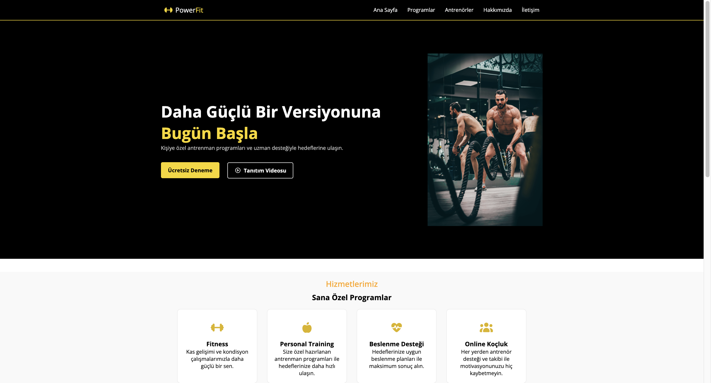

# PowerFit Landing Page

Modern ve responsive bir spor salonu (fitness) açılış sayfası (Landing Page) projesidir.

Bu proje, **HTML5** ve **CSS3** kullanılarak geliştirilmiş olup; responsive web tasarımı, modern CSS teknikleri ve temiz kod yazma becerilerimi geliştirmek amacıyla hazırlanmıştır.

---

# Canlı Demo

👉 https://yunusemretaskin.github.io/powerfit-landing-page/

---

# Ekran Görüntüsü

---

# Proje Hakkında

PowerFit, tek sayfalık (Landing Page) bir spor salonu tanıtım sitesidir.

Projede kullanıcıyı karşılayan bir Hero alanı, hizmet kartları, istatistik bölümü, antrenör kartları, çağrı (CTA) alanı ve modern bir footer tasarlanmıştır.

Responsive tasarım sayesinde site; masaüstü, tablet ve mobil cihazlarda sorunsuz şekilde görüntülenebilmektedir.

---

# Özellikler

- Responsive (Mobil, Tablet ve Masaüstü uyumlu)
- Modern Hero Section
- Hizmet Kartları (Services)
- İstatistik Bölümü (Stats)
- Antrenör Kartları
- Call To Action (CTA)
- Modern Footer
- Hover efektleri ve geçiş animasyonları
- Semantic HTML yapısı

---

# Kullanılan Teknolojiler

- HTML5
- CSS3
- Flexbox
- CSS Grid
- Media Queries
- Font Awesome
- Google Fonts
- Git
- GitHub
- GitHub Pages

---

# Responsive Tasarım

Site aşağıdaki ekran boyutları için optimize edilmiştir.

-  Masaüstü
-  Tablet
-  Mobil

---

# Bu Projede Öğrendiklerim

Bu proje sayesinde aşağıdaki konularda pratik yaptım:

- Semantic HTML kullanımı
- Flexbox ile sayfa düzeni oluşturma
- CSS Grid kullanımı
- Responsive tasarım geliştirme
- Media Query kullanımı
- Container yapısı
- Hover efektleri ve geçiş animasyonları
- Görsellerin responsive kullanımı
- Temiz klasör yapısı oluşturma
- Git ile versiyon kontrolü
- GitHub ile proje yönetimi
- GitHub Pages ile projeyi canlıya alma

---

# Geliştirici

**Yunus Emre Taşkın**

GitHub:
https://github.com/yunusemretaskin
